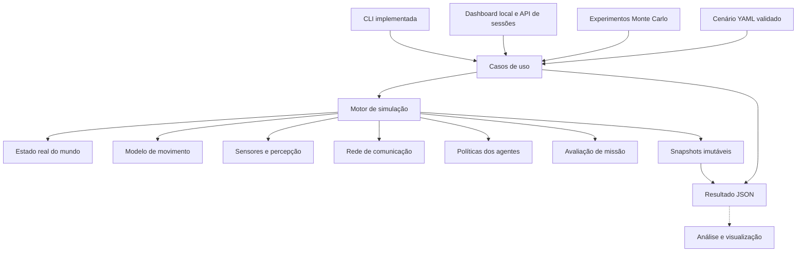

# Arquitetura do MSSA

## Objetivo e escopo

Simular missões com múltiplos agentes aliados, adversários e neutros, sob
incerteza de sensores, limitações de comunicação e variação das condições do
ambiente. Comparar configurações por experimentos Monte Carlo e métricas de missão.

A arquitetura começa como um monólito modular em Python: um processo consegue
executar uma missão completa sem dashboard, servidor, banco de dados ou rede.
A unidade de paralelismo futura será uma execução independente do experimento.
Separar serviços só quando medições de carga ou requisitos de implantação justificarem.

O primeiro modelo é cinemático e 2D. Dimensões e posições usam metros, tempo usa
segundos, velocidade usa m/s e orientação usa graus: 0 aponta para +x e 90 para +y.
`width` e `height` descrevem a área de referência; atualmente não impõem limites.
Colisões, terreno, energia e física 3D exigirão modelos próprios e validação específica.

## Organização e dependências

Linhas tracejadas indicam integrações planejadas. A interface depende dos casos de
uso; o motor não conhece CLI, dashboard, YAML ou arquivos de resultados.

| Módulo | Responsabilidade | Situação |
| --- | --- | --- |
| `agents/` | Identidade, afiliação e estado físico de cada sistema | Implementado, modelo simples |
| `environment/` | Dimensões e relógio do mundo | Implementado, sem terreno |
| `scenarios/` | Esquema versionado, validação e criação de mundos independentes | Implementado |
| `simulation/` | Passos síncronos, snapshots, RNG local e contrato `Dynamics` | Implementado |
| `application/` | Criar e executar simulação, produzir resultado | Implementado |
| `experiments/` | Amostragem, sementes por execução e agregação Monte Carlo | Implementado, sequencial |
| `cli.py` | Entrada de cenários e exportação JSON | Implementado |
| `sensors/` | Alcance, campo de visão, detecção probabilística, ruído e agenda por sensor | Implementado; sem obstáculos ou falsos alarmes |
| `perception/` | Contexto local imutável com a última varredura de cada sensor | Implementado; sem rastreamento ou fusão |
| `communications/` | Enlaces direcionais, alcance, fila em trânsito, latência, perda e TTL | Implementado; sem roteamento ou largura de banda |
| `policies/` | Patrulha por pontos e aproximação/afastamento/parada por percepção local | Implementado; sem identificação persistente de alvos |
| `missions/` | Observar todos os alvos exigidos e registrar tempos de detecção | Implementado; outros tipos de missão planejados |
| `metrics/` | Métricas por missão, execução, equipe e agente | Planejado |
| `recording/` | Eventos, trajetórias, reprodução visual e checkpoints | Planejado |
| `dashboard/` | Editor, mapa 2D, controle de execução, percepção local e tráfego | Implementado como servidor local com assets incluídos no pacote; comparação de lotes futura |

Não criar pacotes vazios para os módulos planejados. Cada módulo entra com um caso
de uso executável, contratos testados e um cenário que demonstre seu comportamento.

## Estado real, percepção e decisão

Há três representações distintas:

1. **Estado real:** posições, velocidades, estado dos sistemas e ambiente. Apenas
   motor, modelos físicos e modelos de sensores têm acesso completo.
2. **Conhecimento local:** medições, mensagens recebidas, estimativas e idade das
   informações disponíveis para um agente.
3. **Comandos:** velocidade e orientação produzidas pela política para seguir um
   ponto ou reagir a uma medição. O motor aplica os comandos na dinâmica e valida
   o próximo estado. Publicar varreduras nos enlaces é uma regra separada da rede.

Uma política não deve receber `WorldState`. Já existe um `AgentContext` imutável,
com estado próprio, observações anônimas locais e mensagens efetivamente recebidas.
Rotas e parâmetros de reação pertencem à configuração da política; futuros
objetivos de alto nível precisarão de contratos próprios.
Um agente só recebe informação externa por seus sensores ou por enlaces declarados. O contrato
`Dynamics` recebe o mundo completo porque representa a evolução física,
não a tomada de decisão autônoma.

Contratos implementados e previstos:

| Contrato | Entrada | Saída |
| --- | --- | --- |
| `GeometricSensor.observe` | Estado real, plataforma e RNG do sensor | Medições com instante, origem e incerteza; implementado |
| `PerceptionModel.update` | Conhecimento anterior, medições e mensagens | Conhecimento local atualizado |
| `PolicySpec.decide` | Contexto local, estado anterior da política e dt | Velocidade, orientação e próximo estado da política; implementado e determinístico |
| `CommunicationSystem.prepare/commit` | Mundo, novas varreduras, filas e RNG por enlace | Entregas, percepção remota e contadores; implementado |
| `Dynamics.propagate` | Agente, snapshot do mundo, dt e RNG | Próximo estado físico; implementado |
| `ObservationMission.consume/result` | Detecções com associação real aos alvos | Progresso, sucesso/timeout e tempos; implementado |
| `MetricCollector.consume` | Eventos e snapshots | Valores e séries de métricas |

As primeiras implementações usarão contratos Python explícitos. Um registro de
modelos mapeará nomes permitidos do cenário para fábricas conhecidas. Não executar
imports arbitrários ou código declarado em YAML.

## Semântica temporal

Hoje o motor captura um snapshot, calcula as varreduras devidas, prepara entregas
e envios e calcula decisões a partir dos contextos locais do passo. Em seguida,
propaga a dinâmica, valida os resultados e só então consolida agentes, relógio,
percepções, políticas, rede e missão. O modelo não pode trocar
identidade ou afiliação. Em uma falha de propagação, mundo, RNG, varreduras,
filas, entregas, contadores, estados das políticas e progresso da missão são preservados;
modelos de movimento devem ser sem estado interno mutável.
O snapshot é uma observação, não um checkpoint de continuação.

A ordem lógica do passo `t → t + dt` é:

1. Capturar estado real em `t` e entregar mensagens cujo prazo já venceu.
2. Executar sensores devidos em `t`, usando o mesmo estado real para todos.
3. Atualizar conhecimentos locais com medições e mensagens entregues.
4. Enfileirar relatórios das novas varreduras e calcular atrasos/perdas; mensagens geradas neste
   passo só ficam visíveis em um passo posterior, inclusive com latência zero.
5. Executar políticas a partir das observações e entregas disponíveis em `t`.
6. Propagar a dinâmica até `t + dt`, consolidar efeitos físicos e avançar o relógio.
7. Avaliar missão e métricas; publicar eventos e snapshot consolidados.

O relógio de simulação é independente do relógio real e da velocidade de renderização.
O passo final pode ser menor que `dt`, e continuar uma execução soma uma nova duração
ao tempo atual. Um contador de passos evita passos extras causados por resíduos
usuais de ponto flutuante; não há promessa de aritmética temporal exata.

Sensores já têm frequências próprias: cada varredura ocorre no primeiro início de
passo elegível, com atraso de quantização menor que `dt`. Há no máximo uma varredura
por sensor por passo; períodos perdidos são descartados. A execução observa o
intervalo `[início, fim)`, sem varredura extra no instante final. A rede já agenda
entregas e expirações e as processa nos inícios de passo; políticas terão agendas
próprias no futuro; hoje decidem em todos os passos. Se for necessária precisão subpasso, o agendador dividirá
o passo no próximo evento. Desempates de eventos usarão `(tempo, prioridade, sequência)`.

A ordem dos agentes declarada no cenário é preservada e faz parte da configuração
reproduzível da dinâmica atual. Sensores já possuem fluxos aleatórios derivados de
seus IDs e da semente da execução; percorrem alvos em ordem de ID. Adicionar outro
sensor não altera um fluxo existente. Nenhum cálculo de movimento enxerga
atualizações parciais de outros agentes dentro do mesmo passo.
Enlaces também possuem fluxos RNG próprios, independentes dos sensores e da dinâmica.

## Aliados, adversários e sistemas neutros

`affiliation` aceita `friendly`, `hostile` e `neutral`. Agentes de qualquer lado
usam os mesmos contratos de dinâmica, sensores, comunicação e política. Um sistema
fixo é um agente com velocidade zero. O cenário `contested.yaml` demonstra uma
equipe aliada, uma patrulha adversária e um sistema adversário fixo.

**Estado atual:** aliados e adversários podem carregar sensores e políticas com
as mesmas regras. A afiliação é validada e preservada nos resultados. O cenário
`patrol_reaction.yaml` demonstra patrulhas aliada/adversária e um agente aliado
que se aproxima das medições recebidas pela rede.

Patrulha por pontos e reação a informação local já existem. Rastreamento persistente,
classificação de contatos e objetivos de área são próximos passos. Modelos abstratos de interferência poderão
alterar disponibilidade, ruído ou entrega de mensagens por regras configuráveis.
Não presumir que adversários compartilham automaticamente informação entre si.

Quando houver mais de duas equipes, introduzir `team_id` e uma matriz explícita
de relações; afiliação sozinha não representa alianças dinâmicas. Capacidades,
objetivos e perfil de comportamento pertencem à configuração de cada sistema,
sem condicionais espalhadas pelo motor para cada lado.

## Sensores e comunicação

O sensor implementado é geométrico 2D: alcance, campo de visão, orientação relativa,
período, probabilidade de detecção e ruído normal independente em x/y. Ocultação por
obstáculos e falsos alarmes continuam planejados. Cada observação inclui identificador
da medição e do sensor, instantes de medição/disponibilidade e desvio padrão.
O identificador real do alvo está disponível exclusivamente para avaliação.

O contexto local guarda a última varredura de cada sensor, com timestamps; uma
nova varredura vazia limpa observações anteriores. Não há identificação persistente
de contatos nem fusão. A missão agrega primeiras detecções pelos observadores
declarados e registra sucesso quando todos os alvos exigidos foram vistos.
A execução mantém seu horizonte completo, mesmo após sucesso; ao final, missões
incompletas reportam `timeout`. Esse conhecimento agregado pertence ao analista,
sem implicar comunicação entre os agentes. Configuração e semântica detalhadas
estão no [guia de observação](observation.md).

A rede implementada publica cada nova varredura nos enlaces de saída explícitos,
incluindo relatórios vazios. Alcance é verificado no envio e na entrega. A fila
limita mensagens em trânsito por enlace, com descarte de novas tentativas quando
cheia. Há latência nominal, perda aleatória no envio e TTL desde a transmissão.
Mesmo com latência zero, a entrega exige um passo posterior. Não há esvaziamento
automático das filas no fim da execução.

Cada destinatário conserva o relatório mais recente por origem/sensor até expirar.
`AgentContext.messages` separa esses relatórios de `observations`, que permanece
restrito aos sensores próprios. Medições compartilhadas mantêm o instante de
medição e ganham o instante real de disponibilidade no destinatário. Não há
compartilhamento implícito entre aliados, retransmissão ou acesso à verdade do alvo.
Regras completas e exemplo estão no [guia de comunicação](communication.md).

Largura de banda, tamanho em bytes e roteamento continuam planejados. A missão
atual pontua detecções locais. Políticas de reação já usam mensagens entregues
para alterar movimento, sem contar recebimentos como novas detecções na missão.

## Políticas e comandos

`PolicySpec.decide` é uma função sem efeitos colaterais que recebe apenas um
`AgentContext`, o estado anterior da política e `dt`. A patrulha acompanha pontos
e pode repetir a rota. A reação seleciona a medição elegível mais recente e depois
a mais próxima, limitada por distância e idade. Pode aproximar-se, afastar-se ou
parar. Sem medição elegível, usa a rota configurada ou fica parada.

O comando ajusta velocidade e orientação antes da propagação; todos os modelos
físicos ainda consultam o mesmo snapshot real do início do passo. O estado da rota
só é consolidado quando o passo termina com sucesso. Não há identificação verdadeira
ou classificação de afiliação nas medições, e a política reage a contatos anônimos.
As limitações cinemáticas e a semântica de chegada estão no [guia do dashboard](dashboard.md).

## Monte Carlo e análise

O executor implementado cria um mundo novo por repetição, sem reutilizar agentes.
Uma semente de experimento determina uma semente de dinâmica e outra de amostragem
para cada execução. A semente de dinâmica do cenário base é substituída no lote,
e cada resultado registra o cenário efetivamente amostrado e sua semente.

Distribuições disponíveis nesta etapa:

- Perturbação normal independente em cada coordenada inicial, com `position_std` em metros.
- Perturbação normal na velocidade inicial ou em `policy.speed`, quando há política,
  com `speed_std` em m/s. Amostras negativas
  são limitadas a zero; isso gera massa em zero e não é uma normal truncada reamostrada.
- Desvios iguais a zero preservam as condições nominais. Como a dinâmica padrão é
  determinística, repetir essas condições não altera o movimento por si só.
- Cada sensor tem probabilidade de detecção e ruído próprios. Isso pode gerar
  resultados de missão diferentes mesmo com condições físicas idênticas.
- Cada enlace tem probabilidade de perda e RNG próprios, produzindo variação na
  disponibilidade de relatórios compartilhados.

As incertezas das condições iniciais são globais para todos os agentes; parâmetros
de medição são configurados por sensor. Não existem ainda variáveis correlacionadas,
ruído temporal correlacionado ou falhas aleatórias de hardware. As posições não são
limitadas pela área do ambiente.

A métrica inicial é a média, entre agentes, da distância entre posição inicial e
final de uma execução. O resumo do lote contém média, mínimo, máximo e desvio padrão
amostral dessa métrica entre execuções; uma execução tem desvio amostral `null`.
Um mundo vazio tem deslocamento médio zero. Isso mede deslocamento líquido, não
comprimento de trajetória nem sucesso de missão.

Quando há missão, o lote também registra quantidade de execuções, sucessos, taxa
de sucesso, execuções com alguma detecção e médias de tempo até primeira detecção
e conclusão. A primeira média considera apenas execuções com detecção, e a segunda
apenas sucessos. Tempos ausentes permanecem `null`. As contagens explicitam os
denominadores; ainda não há intervalos de confiança ou estimativas com censura.

`summary.network` agrega tentativas, mensagens aceitas, entregas, pendências e
descartes por alcance, perda, fila ou expiração. A taxa de entrega usa todas as
tentativas no denominador, incluindo mensagens ainda pendentes. A latência média
usa apenas entregas. Taxas e médias do lote são calculadas pelas somas dos
contadores, sem atribuir o mesmo peso a execuções com quantidades diferentes de tráfego.

Evolução da análise:

- Adicionar outros objetivos e critérios de término além de observação.
- Expandir as métricas de detecção com cobertura, erro de estimação, idade da informação,
  métricas de rede por enlace e disponibilidade dos sistemas.
- Agregar por agente, equipe e missão; registrar denominadores e tratar execuções
  interrompidas explicitamente, sem contá-las silenciosamente como falhas de missão.
- Calcular intervalos de confiança de acordo com a natureza da métrica, incluindo
  proporções para sucesso e métodos apropriados para tempos censurados.
- Comparar alternativas usando sementes pareadas e fluxos por componente.
- Distribuir execuções independentes entre processos, mantendo identificação e
  ordenação estáveis, sem compartilhar RNG ou estado mutável.

Reprodutibilidade exige cenário, sementes, versões dos modelos, versão do código
e ambiente de execução compatíveis. Hoje o JSON registra cenário e sementes;
manifesto de versões e hash do cenário serão adicionados antes de estudos formais.
Não prometer resultados idênticos entre versões diferentes do runtime ou dos modelos.

## Resultados, armazenamento e interface

`RunResult` guarda configuração efetiva, snapshots inicial/final, percepções finais,
contagens de varreduras/detecções, métricas da rede e resultado da missão. O resultado de Monte Carlo
guarda o cenário base, configuração do experimento, repetições e resumo.
O formato JSON tem versão própria, separada da versão do cenário.

Não há histórico completo em memória por passo. O lote atual mantém todos os
resultados finais, incluindo percepções; a memória depende também do número de
medições na última varredura de cada sensor e nos relatórios recebidos. A rede limita
mensagens em trânsito por enlace, mas ainda não limita bytes por relatório. Para lotes
grandes, adicionar gravação incremental por execução e agregadores incrementais.

Eventos futuros terão `run_id`, sequência, tempo simulado, tipo, origem e payload
versionado. Checkpoints também precisarão do RNG, filas de rede, estimadores,
políticas e agendador; snapshots isolados não permitem retomar uma simulação.

O dashboard já oferece editor de cenário, mapa 2D, visualização da verdade e da
percepção selecionada e controle de execução. Um adaptador HTTP local mantém
sessões isoladas e avança o motor sob demanda. O frontend usa canvas e não depende
de serviços externos ou ferramentas de build. Alterações de cenário são validadas
e criam uma nova simulação, sem editar diretamente o mundo em execução.

Eventos de rede do último passo e mensagens pendentes alimentam a visualização.
A interface retém até 200 eventos e 600 posições por agente; não é um gravador
completo de trajetórias. Arquivos YAML são importados/exportados pelo navegador.
O modo em lote e a análise Monte Carlo continuam acessíveis pela CLI e por Python;
comparação de lotes na interface fica para uma etapa futura.

## Validação e sequência de implementação

| Etapa | Entrega | Critério de conclusão |
| --- | --- | --- |
| 1 — Fundação | Esquema, motor extensível, snapshots, afiliação, CLI e Monte Carlo básico | Implementada; compatibilidade e reprodutibilidade cobertas por testes |
| 2 — Missão observável | Sensor geométrico, percepção local, missão de observação e métricas de detecção | Implementada; contexto restrito, geometria, amostragem e métricas cobertos por testes |
| 3 — Comunicação | Mensagens, filas, latência, perdas, TTL e publicação de varreduras | Implementada; tempo, capacidade, isolamento e métricas testados; reação autônoma fica na etapa 4 |
| 4 — Políticas locais | Patrulha e reação por observações/mensagens | Implementada para qualquer lado; objetivos por equipe e rastreamento seguem planejados |
| 5 — Estudos | Incertezas por componente, falhas, sementes pareadas e intervalos de confiança | Comparações reproduzíveis e métricas verificadas em casos controlados |
| 6 — Escala e interface | Dashboard, execução paralela, gravação incremental e reprodução visual | Dashboard local implementado; paralelismo, reprodução de histórico e análise de lotes pendentes |

Usar testes analíticos para dinâmica e geometria, testes de fronteira para eventos,
testes de isolamento para percepção/rede e testes estatísticos com sementes fixas e
tolerâncias justificadas para modelos probabilísticos. Medir convergência ao reduzir
`dt`; um teste de software aprovado não demonstra fidelidade ao mundo real.

Os próximos incrementos são rastreamento/classificação de contatos, missões que
exijam informar um coordenador e análise de experimentos Monte Carlo no dashboard.
